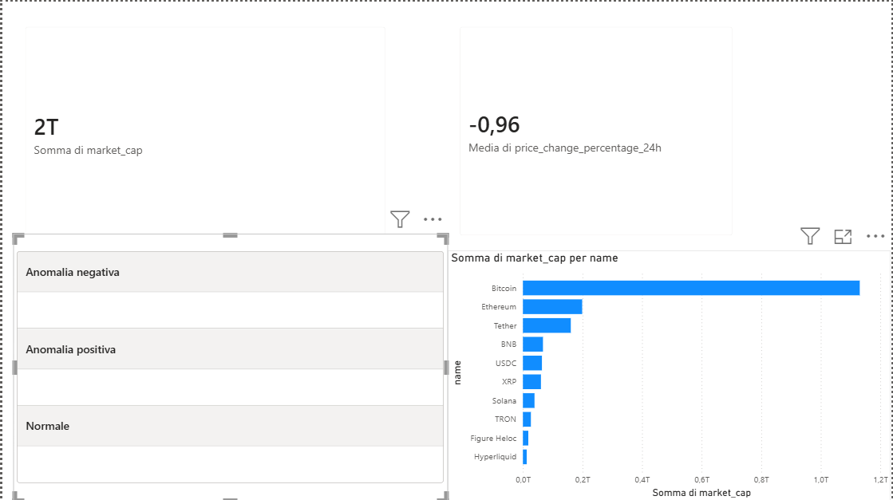

# 📊 Crypto Data Pipeline

Pipeline dati end-to-end che estrae dati di mercato delle criptovalute, li trasforma con PySpark su Databricks e li rende pronti per l'analisi tramite dashboard Power BI.

## 🎯 Obiettivo del progetto

L'obiettivo di questo progetto è simulare un flusso di lavoro realistico da Data Engineer: dall'estrazione di dati grezzi da una fonte esterna (API pubblica), alla loro trasformazione e pulizia, fino alla resa disponibile per l'analisi di business.

Il progetto replica un pattern comune nei contesti aziendali: raw → clean → curated → reporting, e dimostra competenze pratiche su Python, PySpark, Databricks, Delta Lake e Power BI.

## 🏗️ Architettura

CoinGecko API → Python (extract) → Databricks/PySpark (transform) → Delta Lake (storage) → Power BI (visualizzazione)

## 🛠️ Stack tecnologico

- **Python** – estrazione dati tramite API REST
- **PySpark** – trasformazione, pulizia e analisi statistica dei dati
- **Databricks** – ambiente di esecuzione e storage
- **Delta Lake** – storage con versionamento (time travel)
- **Power BI** – dashboard e visualizzazione

## 📁 Struttura del progetto

crypto-data-pipeline/
├── extract/
│   └── extract_data.py               # Script Python di estrazione dati da CoinGecko
├── transform/
│   └── transform_crypto_data.ipynb   # Notebook PySpark: pulizia, trasformazione, analisi statistica, Delta Lake
├── data/
│   └── raw_crypto_data_*.csv         # Dati grezzi estratti
├── dashboard/
│   └── crypto_dashboard.pbix         # Dashboard Power BI
├── docs/
│   └── dashboard_overview.png        # Screenshot della dashboard
├── requirements.txt
└── README.md

## 🔄 Fasi del progetto

### 1. Estrazione dati
Script Python che chiama l'API pubblica di CoinGecko per ottenere dati di mercato aggiornati delle top 50 criptovalute (prezzo, market cap, volume, variazione 24h).

### 2. Trasformazione (PySpark)
Su Databricks, i dati grezzi vengono:
- Puliti e ridotti alle colonne rilevanti
- Arricchiti con una colonna calcolata (volatility_flag) che classifica la volatilità in base alla variazione percentuale nelle 24h

### 3. Analisi statistica
Oltre alla classificazione base, il progetto integra un layer di analisi statistica più rigoroso:
- **Z-score**: la volatilità viene misurata come deviazione standardizzata rispetto alla media di mercato, invece di soglie arbitrarie. Questo approccio si adatta al contesto: un calo del -5% può risultare "normale" in un giorno di mercato mediamente debole.
- **Matrice di correlazione**: analizzata la relazione tra prezzo, market cap, volume e variazione 24h.

### 4. Storage con Delta Lake
I dati trasformati vengono salvati come tabella Delta, sfruttando il versionamento automatico: è possibile interrogare lo storico delle modifiche e tornare a versioni precedenti dei dati tramite time travel (VERSION AS OF).

### 5. Visualizzazione (Power BI)
Dashboard interattiva con KPI su market cap, variazione media 24h, e distribuzione della volatilità secondo l'analisi z-score.

## ▶️ Come eseguire il progetto

1. Clona la repository
2. Crea un ambiente virtuale e installa le dipendenze:
   python -m venv venv
   venv\Scripts\activate
   pip install -r requirements.txt
3. Esegui lo script di estrazione:
   cd extract
   python extract_data.py
4. Carica il CSV generato su Databricks e apri il notebook transform_crypto_data.ipynb
5. Apri dashboard/crypto_dashboard.pbix in Power BI Desktop

## 📌 Stato del progetto

- [x] Estrazione dati (Python)
- [x] Trasformazione dati (PySpark)
- [x] Analisi statistica (z-score, correlazione)
- [x] Storage con Delta Lake + time travel
- [x] Dashboard Power BI
- [x] Screenshot e documentazione finale

Progetto realizzato per esercitarmi con lo stack Python/PySpark/Databricks/Power BI appreso durante il percorso formativo in Capgemini.